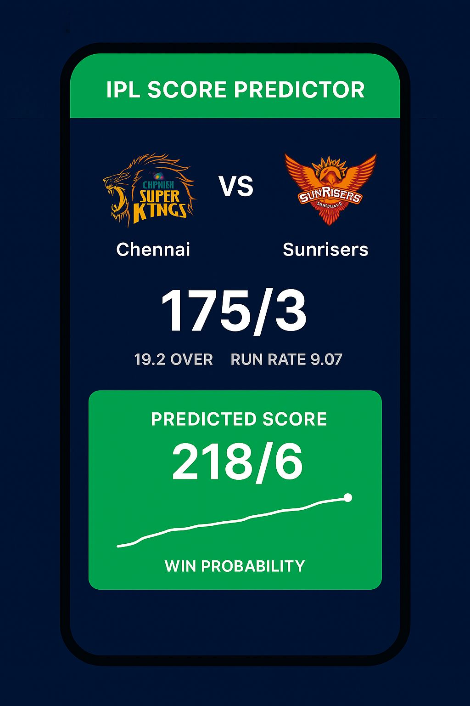

# 🏏 IPL First Innings Score Prediction

  

 
 

---

## 📌 Project Overview
- Built a machine learning model that predicts the **first-innings score range** in IPL matches.  
- Optimized **Multiple Linear Regression, Decision Tree, Random Forest, and AdaBoost** regression models using GridSearchCV.  

---

## 🎯 How Will This Project Help?
This project can assist **fantasy cricket fans** (e.g., Dream11 players) in estimating first-innings scores and gaining extra fantasy points.  

---

## 🛠️ Resources Used
- **Packages**: pandas, numpy, sklearn, matplotlib, seaborn  
- **Dataset by [Shivam Mitra](https://github.com/codophobia/CricketScorePredictor)**  

---

## 🧹 Data Cleaning and Preprocessing
- Removed unwanted columns  
- Kept only consistent teams  

  

- Removed first 5 overs data in every match  
- Converted `date` column into datetime object  
- Encoded categorical features  

---

## 🏗️ Model Building and Evaluation
Evaluation Metric → **Root Mean Squared Error (RMSE)**  

| Model                  | RMSE   |
|-------------------------|--------|
| Multiple Linear         | 15.84  |
| Decision Tree           | 23.04  |
| Random Forest           | 18.17  |
| **AdaBoost (Best)**     | **15.79** |

✅ On average, the best model (AdaBoost) predicts the score within **±15 runs**.  

---

## 🔮 Model Prediction

  

---

## 🚀 Future Scope
- Add features for top batsmen and bowlers of all teams.  
- Include striker/non-striker strike rates.  
- Experiment with **Artificial Neural Networks (ANNs)**.  

---

## 🌐 Deployed Web App
🎉 Check out the live app here → [IPL Score Predictor on Streamlit](https://ipl-score-predictor.streamlit.app/)  

---

✍️ Developed by **Saurabh Ranjan**  
